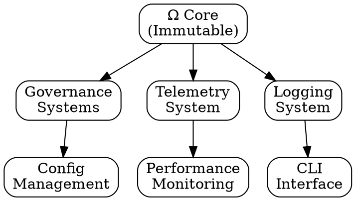
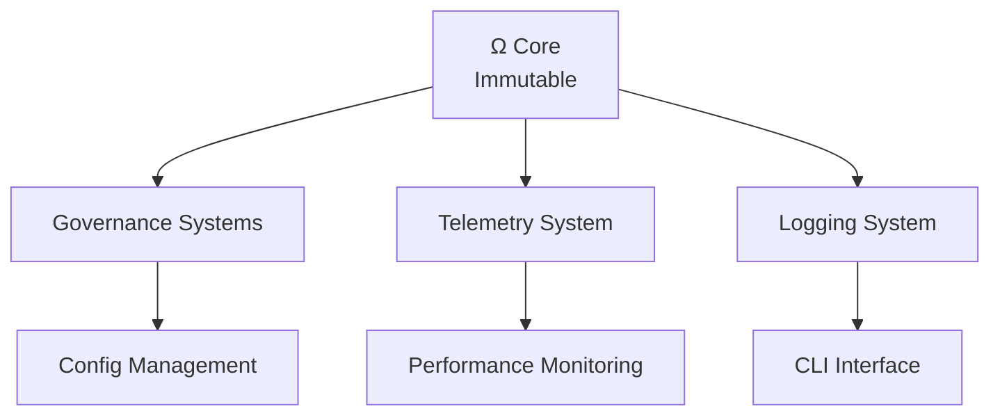

# Ω-ABSOLUTE Enhanced Foundation Architecture Visualization

## High-Level Architecture

```
┌─────────────────────────────────────────────────────────────────┐
│                    Ω-ABSOLUTE Enhanced Foundation               │
│                  Bounded Self-Synthesizing Causal Intelligence   │
└─────────────────────────────────────────────────────────────────┘
                                │
                                ▼
┌─────────────────────────────────────────────────────────────────┐
│                         IMMUTABLE Ω CORE                         │
│  ┌───────────────────────────────────────────────────────────┐  │
│  │  Identity: Ω-ABSOLUTE                                      │  │
│  │  Safety Boundaries: 8 immutable rules                      │  │
│  │  Resource Ceilings: 5 hard limits                          │  │
│  │  Promotion Requirements: 7 gates                          │  │
│  │  Verification Hierarchy: 4 levels                          │  │
│  └───────────────────────────────────────────────────────────┘  │
└─────────────────────────────────────────────────────────────────┘
                                │
                ┌───────────────┼───────────────┐
                ▼               ▼               ▼
        ┌──────────────┐ ┌──────────────┐ ┌──────────────┐
        │  GOVERNANCE  │ │  TELEMETRY   │ │  LOGGING     │
        │   SYSTEMS    │ │   SYSTEM     │ │   SYSTEM     │
        └──────────────┘ └──────────────┘ └──────────────┘
                │               │               │
                └───────────────┼───────────────┘
                                ▼
┌─────────────────────────────────────────────────────────────────┐
│                      META-CONTROLLER                             │
│              Decision Surface & Safety Enforcement               │
└─────────────────────────────────────────────────────────────────┘
                                │
                ┌───────────────┼───────────────┐
                ▼               ▼               ▼
        ┌──────────────┐ ┌──────────────┐ ┌──────────────┐
        │  CONFIG      │ │ PERFORMANCE  │ │     CLI      │
        │  MANAGEMENT  │ │  MONITORING  │ │  INTERFACE   │
        └──────────────┘ └──────────────┘ └──────────────┘
```

## Detailed Component Architecture

### Core Governance Systems

```
┌─────────────────────────────────────────────────────────────────┐
│                      GOVERNANCE SYSTEMS                          │
├─────────────────────────────────────────────────────────────────┤
│                                                                 │
│  ┌─────────────────────────────────────────────────────────┐  │
│  │              CLAIM DISCIPLINE (Enhanced)                   │  │
│  │  • State-to-claim mapping                                │  │
│  │  • Enhanced error context                                 │  │
│  │  • Safe status strings                                    │  │
│  └─────────────────────────────────────────────────────────┘  │
│                                                                 │
│  ┌─────────────────────────────────────────────────────────┐  │
│  │                  GAP MATRIX                               │  │
│  │  • Component registration                                │  │
│  │  • State tracking                                        │  │
│  │  • Markdown export                                       │  │
│  └─────────────────────────────────────────────────────────┘  │
│                                                                 │
│  ┌─────────────────────────────────────────────────────────┐  │
│  │               CHANGE CONTROL                             │  │
│  │  • Approval workflow                                    │  │
│  │  • Rollback mechanisms                                   │  │
│  │  • Audit trail                                          │  │
│  └─────────────────────────────────────────────────────────┘  │
│                                                                 │
│  ┌─────────────────────────────────────────────────────────┐  │
│  │                PROVENANCE TRACKING                       │  │
│  │  • Source attribution                                    │  │
│  │  • Confidence scoring                                   │  │
│  │  • Transformation history                               │  │
│  └─────────────────────────────────────────────────────────┘  │
│                                                                 │
│  ┌─────────────────────────────────────────────────────────┐  │
│  │              REPRODUCIBILITY LEDGER                       │  │
│  │  • Experiment tracking                                   │  │
│  │  • Status machine                                        │  │
│  │  • Hash verification                                     │  │
│  └─────────────────────────────────────────────────────────┘  │
│                                                                 │
└─────────────────────────────────────────────────────────────────┘
```

### Telemetry and Monitoring Systems

```
┌─────────────────────────────────────────────────────────────────┐
│                  TELEMETRY & MONITORING                         │
├─────────────────────────────────────────────────────────────────┤
│                                                                 │
│  ┌─────────────────────────────────────────────────────────┐  │
│  │               RESOURCE TRACKER                           │  │
│  │  • Token usage tracking                                  │  │
│  │  • Tool call counting                                    │  │
│  │  • Wall time measurement                                 │  │
│  │  • Memory monitoring                                     │  │
│  │  • Ceiling enforcement                                    │  │
│  └─────────────────────────────────────────────────────────┘  │
│                                                                 │
│  ┌─────────────────────────────────────────────────────────┐  │
│  │               TELEMETRY BUS                              │  │
│  │  • Event publishing                                      │  │
│  │  • Subscriber pattern                                    │  │
│  │  • Event filtering                                       │  │
│  │  • Buffer management                                     │  │
│  └─────────────────────────────────────────────────────────┘  │
│                                                                 │
│  ┌─────────────────────────────────────────────────────────┐  │
│  │             STRUCTURED LOGGING (NEW)                      │  │
│  │  • Context-aware logging                                 │  │
│  │  • Multiple output targets                               │  │
│  │  • Log level filtering                                   │  │
│  │  • JSON export capability                                │  │
│  │  • Statistics generation                                 │  │
│  └─────────────────────────────────────────────────────────┘  │
│                                                                 │
│  ┌─────────────────────────────────────────────────────────┐  │
│  │          PERFORMANCE MONITORING (NEW)                     │  │
│  │  • Timing metrics                                        │  │
│  │  • Memory profiling                                      │  │
│  │  • Custom metrics                                        │  │
│  │  • Context managers                                      │  │
│  │  • Statistical analysis                                  │  │
│  └─────────────────────────────────────────────────────────┘  │
│                                                                 │
│  ┌─────────────────────────────────────────────────────────┐  │
│  │               PROFILER (NEW)                              │  │
│  │  • Function decorators                                    │  │
│  │  • Call counting                                         │  │
│  │  • Memory tracking                                       │  │
│  │  • Performance statistics                                 │  │
│  └─────────────────────────────────────────────────────────┘  │
│                                                                 │
└─────────────────────────────────────────────────────────────────┘
```

### Configuration and Interface Systems

```
┌─────────────────────────────────────────────────────────────────┐
│               CONFIGURATION & INTERFACES                        │
├─────────────────────────────────────────────────────────────────┤
│                                                                 │
│  ┌─────────────────────────────────────────────────────────┐  │
│  │           CONFIGURATION MANAGEMENT (NEW)                 │  │
│  │  • YAML/JSON support                                     │  │
│  │  • Configuration validation                              │  │
│  │  • Environment-specific configs                          │  │
│  │  • Runtime reloading                                     │  │
│  │  • Export capabilities                                    │  │
│  └─────────────────────────────────────────────────────────┘  │
│                                                                 │
│  ┌─────────────────────────────────────────────────────────┐  │
│  │                CLI INTERFACE (NEW)                       │  │
│  │  • Status command                                        │  │
│  │  • Testing interface                                     │  │
│  │  • Component inspection                                  │  │
│  │  • Resource demonstrations                               │  │
│  │  • Logging demonstrations                                │  │
│  │  • solve() API demos                                     │  │
│  └─────────────────────────────────────────────────────────┘  │
│                                                                 │
└─────────────────────────────────────────────────────────────────┘
```

## Data Flow Architecture

### Foundation Data Flow

```
┌──────────────┐
│   USER/API   │
└──────┬───────┘
       │
       ▼
┌──────────────┐
│     CLI      │
└──────┬───────┘
       │
       ├──────────────┬──────────────┬──────────────┐
       ▼              ▼              ▼              ▼
┌──────────────┐ ┌──────────────┐ ┌──────────────┐ ┌──────────────┐
│  OMEGA CORE  │ │    CONFIG    │ │   LOGGER     │ │  MONITOR     │
└──────┬───────┘ └──────┬───────┘ └──────┬───────┘ └──────┬───────┘
       │               │               │               │
       └───────────────┼───────────────┴───────────────┘
                       │
                       ▼
            ┌──────────────────┐
            │ META-CONTROLLER  │
            └────────┬─────────┘
                     │
                     ▼
            ┌──────────────────┐
            │  GOVERNANCE      │
            │  SYSTEMS         │
            └────────┬─────────┘
                     │
                     ▼
            ┌──────────────────┐
            │  TELEMETRY       │
            │  SYSTEM          │
            └────────┬─────────┘
                     │
                     ▼
            ┌──────────────────┐
            │  RESULT/OUTPUT   │
            └──────────────────┘
```

### Error Handling Flow

```
┌──────────────┐
│   OPERATION  │
└──────┬───────┘
       │
       ▼
┌──────────────┐
│   ATTEMPT    │
└──────┬───────┘
       │
       ├──────────┐
       │          ▼
       │    ┌──────────────┐
       │    │   SUCCESS    │
       │    └──────┬───────┘
       │           │
       │           ▼
       │    ┌──────────────┐
       │    │    LOG       │
       │    │   SUCCESS    │
       │    └──────┬───────┘
       │           │
       │           ▼
       │    ┌──────────────┐
       │    │   RETURN     │
       │    │   RESULT     │
       │    └──────────────┘
       │
       └──────────┐
                  ▼
           ┌──────────────┐
           │    FAILURE    │
           └──────┬───────┘
                  │
                  ▼
           ┌──────────────┐
           │ ENHANCED     │
           │   ERROR      │
           └──────┬───────┘
                  │
                  ├──────────────┐
                  │              ▼
                  │      ┌──────────────┐
                  │      │   EXTRACT    │
                  │      │   CONTEXT    │
                  │      └──────┬───────┘
                  │             │
                  │             ▼
                  │      ┌──────────────┐
                  │      │     LOG      │
                  │      │   ERROR      │
                  │      └──────┬───────┘
                  │             │
                  │             ▼
                  │      ┌──────────────┐
                  │      │   CONVERT    │
                  │      │   TO DICT    │
                  │      └──────┬───────┘
                  │             │
                  └─────────────┤
                                ▼
                      ┌──────────────┐
                      │     RAISE    │
                      │   EXCEPTION  │
                      └──────────────┘
```

## Integration Architecture

### System Integration Points

```
┌─────────────────────────────────────────────────────────────────┐
│                    INTEGRATION ARCHITECTURE                     │
├─────────────────────────────────────────────────────────────────┤
│                                                                 │
│  LOGGING ──────────────────────────────────────────► TELEMETRY │
│  (Structured events)                     (Event bus)              │
│                                                                 │
│  CONFIG ──────────────────────────────────────────► CORE       │
│  (Resource limits)                       (Ceiling enforcement)   │
│                                                                 │
│  MONITOR ─────────────────────────────────────────► LOGGING    │
│  (Performance data)                      (Performance logs)      │
│                                                                 │
│  CLI ───────────────────────────────────────────► ALL SYSTEMS │
│  (User commands)                         (Inspection/control)    │
│                                                                 │
│  GOVERNANCE ─────────────────────────────────────► CORE       │
│  (Safety rules)                          (Boundary enforcement)  │
│                                                                 │
│  TELEMETRY ─────────────────────────────────────► MONITOR    │
│  (Resource data)                         (Performance metrics)   │
│                                                                 │
└─────────────────────────────────────────────────────────────────┘
```

## Component Hierarchy

### Package Structure

```
omega_absolute_enhanced/
├── runtime/
│   ├── core/
│   │   ├── omega_core.py (ENHANCED)
│   │   ├── meta_controller.py
│   │   └── version.py
│   ├── governance/
│   │   ├── states.py
│   │   ├── claim_discipline.py (ENHANCED)
│   │   ├── gap_matrix.py
│   │   ├── change_control.py
│   │   ├── provenance.py
│   │   ├── reproducibility.py
│   │   └── __init__.py
│   ├── telemetry/
│   │   ├── events.py
│   │   ├── tracker.py
│   │   └── __init__.py
│   ├── logging/ (NEW)
│   │   ├── structured_logger.py
│   │   ├── log_formatter.py
│   │   ├── integration.py
│   │   └── __init__.py
│   ├── config/ (NEW)
│   │   ├── config_manager.py
│   │   ├── default_config.py
│   │   └── __init__.py
│   ├── performance/ (NEW)
│   │   ├── performance_monitor.py
│   │   ├── profiler.py
│   │   └── __init__.py
│   └── __init__.py
├── tests/
│   ├── unit/
│   │   └── test_core.py (ENHANCED - 30+ tests)
│   └── integration/
│       └── test_foundation_integration.py (NEW)
├── docs/
│   ├── FOUNDATION_RELEASE.md
│   ├── ARCHITECTURE.md
│   ├── INVARIANTS.md
│   ├── GOVERNANCE.md
│   └── CHANGELOG.md
├── cli.py (NEW)
├── omega.py (ENHANCED)
├── config.yaml (NEW)
├── demo_cli.py (NEW)
├── demo_foundation.py (NEW)
├── demo_api.py (NEW)
├── API_DOCUMENTATION.md (NEW)
├── ENHANCED_FOUNDATION_README.md (NEW)
└── ARCHITECTURE_VISUALIZATION.md (NEW)
```

## State Machine Diagrams

### Component Lifecycle

```
┌─────────────┐
│ NOT_DESIGNED│
└──────┬──────┘
       │
       ▼
┌─────────────┐
│   DESIGNED   │
└──────┬──────┘
       │
       ▼
┌─────────────┐
│ SCAFFOLDED  │
└──────┬──────┘
       │
       ▼
┌─────────────┐
│ IMPLEMENTED │◄─────────────────┐
└──────┬──────┘                   │
       │                         │
       ▼                         │
┌─────────────┐                   │
│   TESTED    │                   │
└──────┬──────┘                   │
       │                         │
       ▼                         │
┌─────────────┐                   │
│  INTEGRATED │                   │
└──────┬──────┘                   │
       │                         │
       ▼                         │
┌─────────────┐                   │
│ BENCHMARKED │                   │
└──────┬──────┘                   │
       │                         │
       ▼                         │
┌─────────────┐                   │
│   VERIFIED  │───────────────────┘
└──────┬──────┘
       │
       ▼
┌─────────────┐
│  PROMOTED   │
└──────┬──────┘
       │
       ├──────────┐
       │          ▼
       │   ┌─────────────┐
       │   │ DEPRECATED  │
       │   └──────┬──────┘
       │          │
       │          ▼
       │   ┌─────────────┐
       │   │   RETIRED   │
       │   └─────────────┘
       │
       └──────────┐
                  ▼
          (Promotion Gate)
```

### Change Control Lifecycle

```
┌─────────────┐
│  PROPOSED   │
└──────┬──────┘
       │
       ├──────────┐
       │          ▼
       │   ┌─────────────┐
       │   │  APPROVED   │
       │   └──────┬──────┘
       │          │
       │          ▼
       │   ┌─────────────┐
       │   │   APPLIED   │◄─────────┐
       │   └──────┬──────┘           │
       │          │                   │
       │          ├──────────┐       │
       │          │          ▼       │
       │          │   ┌─────────────┐ │
       │          │   │ ROLLED_BACK │─┘
       │          │   └─────────────┘
       │          │
       │          └──────────┐
       │                     │
       └──────────┐          │
                  │          │
                  ▼          │
           ┌─────────────┐   │
           │  REJECTED   │   │
           └─────────────┘   │
                              │
                              └─────────────────┘
```

## Security Architecture

### Governance Boundaries

```
┌─────────────────────────────────────────────────────────────────┐
│                    IMMUTABLE Ω CORE                             │
│                   (Governance Boundary)                         │
├─────────────────────────────────────────────────────────────────┤
│                                                                 │
│  PROTECTED:                                                      │
│  • Identity                                                     │
│  • Safety boundaries                                            │
│  • Resource ceilings                                            │
│  • Promotion requirements                                        │
│  • Verification hierarchy                                        │
│  • Rollback mechanisms                                          │
│                                                                 │
│  GOVERNED:                                                      │
│  • Component states                                             │
│  • Change logs                                                  │
│  • Claim discipline enforcement                                 │
│  • Gap matrix updates                                           │
│                                                                 │
│  ALLOWED:                                                       │
│  • Solver strategies                                            │
│  • Domain models                                                │
│  • Capability compositions                                       │
│  • Architecture selection                                       │
│                                                                 │
└─────────────────────────────────────────────────────────────────┘
                              │
                              ▼
┌─────────────────────────────────────────────────────────────────┐
│                     GOVERNED SYSTEMS                             │
│                   (Controlled Mutation)                          │
├─────────────────────────────────────────────────────────────────┤
│                                                                 │
│  All changes require:                                           │
│  • Change control records                                       │
│  • Approval workflow                                            │
│  • Rollback plans                                               │
│  • Audit trails                                                 │
│                                                                 │
└─────────────────────────────────────────────────────────────────┘
```

## Rendering Instructions

### ASCII Art Rendering
The diagrams in this document are rendered using ASCII characters and can be viewed in any text editor or terminal.

### Graphviz Visualization
For professional visualization, the architecture can be rendered using Graphviz DOT format:



### Mermaid.js Visualization
For web-based visualization, Mermaid.js can be used:



## Summary

The enhanced foundation architecture provides:

- **Immutable Core**: Strong governance boundaries
- **Enhanced Systems**: Logging, configuration, performance monitoring
- **Integration**: Well-defined integration points between all systems
- **Observability**: Comprehensive monitoring and logging
- **Safety**: Multi-layered governance and enforcement
- **Extensibility**: Clear paths for Phase 1 implementation

This architecture serves as a robust foundation for building the complete Ω-ABSOLUTE system while maintaining safety, observability, and maintainability.